# 学会使用这15个轮播图制作工具,三分钟搞定社交媒体内容

社交媒体运营者和内容创作者最头疼的事,就是每天要为LinkedIn、Instagram、TikTok等平台制作大量视觉吸引力强的轮播图内容。手动设计不仅耗时,还需要掌握复杂的设计软件,往往一张图就要折腾大半天。本文精选15款专业轮播图制作工具,涵盖从AI自动生成到模板快速定制、从零代码操作到高级编辑功能,帮你在几分钟内批量产出高质量的轮播内容,让社交媒体运营效率提升10倍以上。

## **[CreateCarousel](https://www.createcarousel.com)**

零门槛快速启动的轮播图专用平台

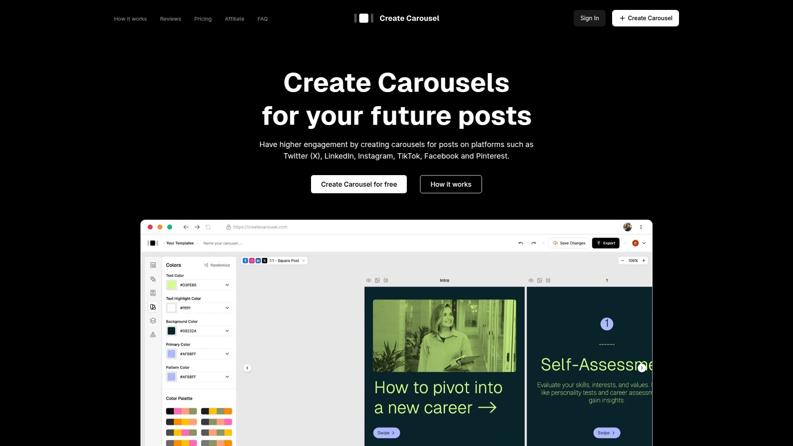

CreateCarousel提供超过25款专业设计的免费轮播模板,让非设计背景的用户也能快速创建引人注目的社交媒体内容。平台核心优势在于极简的操作流程:浏览模板库、选择符合品牌风格的设计、自定义文字和视觉元素、导出发布,整个过程不超过5分钟。内置隐私控制功能,确保只有授权用户可以访问你的设计文件。图像编辑器支持透明度调整和字体嵌入,让你的轮播图在Instagram、Pinterest等平台上呈现最佳视觉效果。定价策略友好,提供完全免费的基础版,高级功能套餐每月仅需6.66美元(原价7.99美元)。免费版已包含大量预设模板和高级图标库,足够个人创作者和小型团队日常使用。详细的教程页面手把手教你如何将轮播图发布到Instagram、Pinterest等不同平台,解决了很多新手的技术困惑。

## **[aiCarousels](https://www.aicarousels.com)**

AI驱动的智能轮播内容生成器

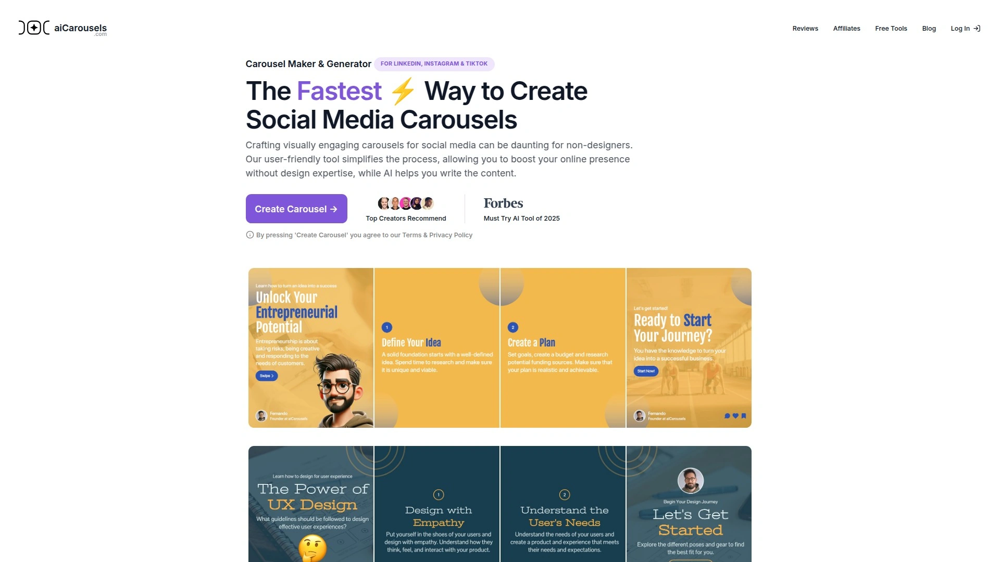

aiCarousels最大亮点是无需注册即可开始使用的AI轮播生成器,支持LinkedIn、Instagram和TikTok三大主流平台。你可以直接输入主题让AI撰写引人入胜的轮播文案,或者粘贴YouTube视频链接自动提取内容转化为轮播图。AI写作助手能根据你的指令调整内容风格,比如"加入幽默轻松的评论"或"缩短段落使其更简洁"。平台提供数百款可病毒式传播的模板,结合AI技术让你的帖子真正脱颖而出。元素自动调整大小功能确保完美定位和清晰字号,无需手动微调。精心挑选的配色方案和字体配对消除了"什么搭配好看"的猜测,让设计和谐统一。品牌定制功能允许你在轮播模板中体现一致的视觉身份识别。PRO计划还解锁了社交媒体帖子编辑器、引用卡片生成器、创意灵感生成器等全套内容创作工具,就像拥有一把瑞士军刀。

## **[Canva](https://www.canva.com)**

全球7500万用户信赖的设计巨头

Canva是社交媒体设计领域的行业标准,提供适用于任何平台的海量免费和付费轮播Instagram帖子模板。专业设计师制作的现成布局让你无需担心帖子看起来平淡无奇,只需点击模板在直观的拖放编辑器中修改即可。丰富的媒体库包含免费和付费的图片、视频、音乐、图表、图标、插图、形状和贴纸。一键动画效果、动态转场和字幕动画让短视频轮播更具吸引力。Google Veo 3技术支持的AI视频生成功能,可以通过简单文字提示创建影院级画质片段。增强语音功能消除背景噪音,让音频清晰响亮。除了Instagram轮播,还支持TikTok视频、Stories、Reels、YouTube缩略图、Facebook帖子等全平台内容制作。移动应用和网页端完全同步,随时随地编辑发布。

## **[Taplio](https://taplio.com/carousel)**

LinkedIn轮播专业解决方案

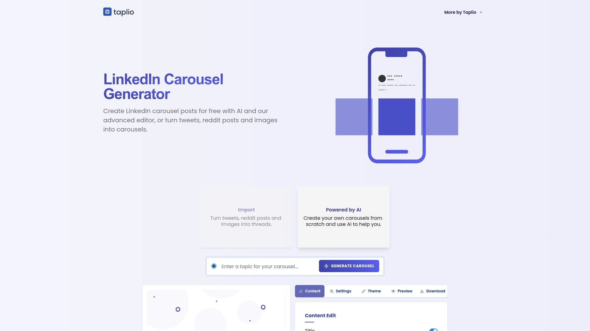

Taplio专注于LinkedIn平台的轮播生成,深度理解职场社交网络的内容调性。平台针对LinkedIn的算法特点优化模板设计,确保你的轮播帖获得最大曝光和互动。适合B2B营销人员、职业发展教练、思想领袖等需要在LinkedIn上建立个人品牌的专业人士。

## **[Contentdrips](https://contentdrips.com)**

完全免费的LinkedIn轮播生成器

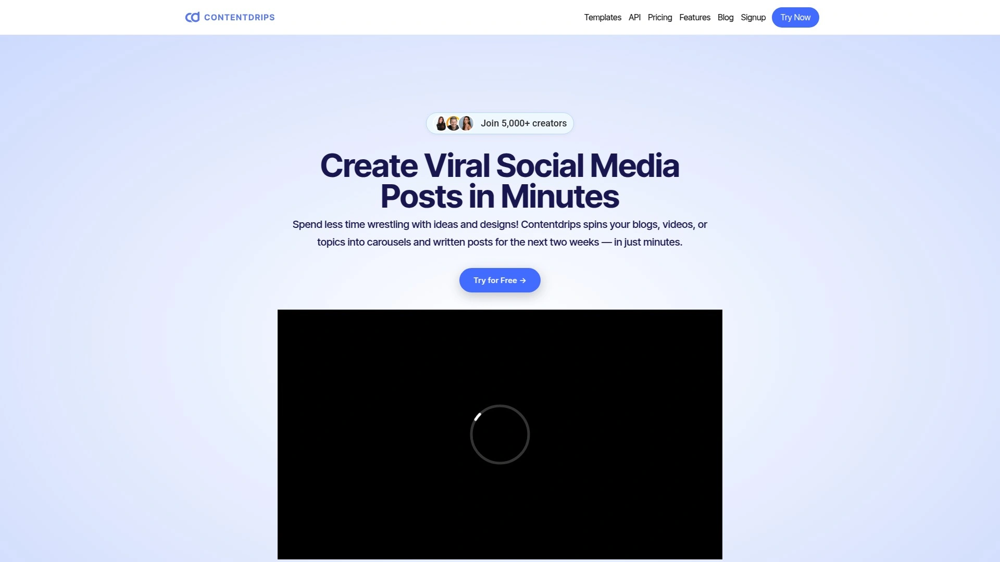

Contentdrips提供永久免费的基础轮播制作工具,没有隐藏费用,随时可以制作轮播图。免费计划每月提供5次下载,带水印但功能完整。升级到每月26美元的Starter套餐后,可以解锁所有模板(包括专业和独家模板)、无限下载、去除水印、AI功能、自定义字体和Logo、无限品牌支持、团队成员协作、帖子撰写工具、直接发布到LinkedIn等全套功能。特色功能包括AI轮播生成器、博客转轮播、CSV转轮播、文本转轮播等多种内容输入方式。与Zapier集成实现自动化工作流。每月提供1200个AI积分用于内容生成。

## **[Supergrow](https://www.supergrow.ai)**

20+即用型LinkedIn轮播模板库

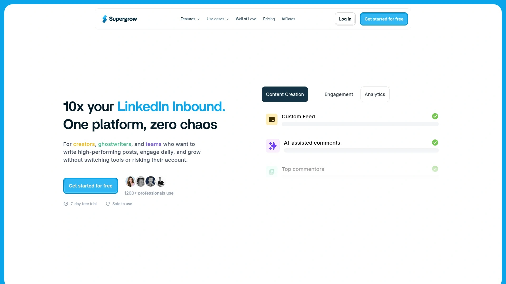

Supergrow Carousel Generator拥有20多款现成的轮播模板,帮助你在几分钟内创建LinkedIn轮播并直接发布。核心优势是品牌工具包保存和配置功能,节省重复设置时间。文本转轮播能力可以根据内容秒速生成轮播图。支持从YouTube、博客和PDF文档创建轮播,复用现有内容扩大传播范围。内置日程安排和发布功能,直接连接LinkedIn账户一键发布。定价从每月19美元起,对创建轮播数量不设上限。编辑选项相对有限是唯一不足,但对追求效率的用户来说瑕不掩瑜。

## **[Piktochart](https://piktochart.com)**

AI信息图表与轮播制作一体化工具

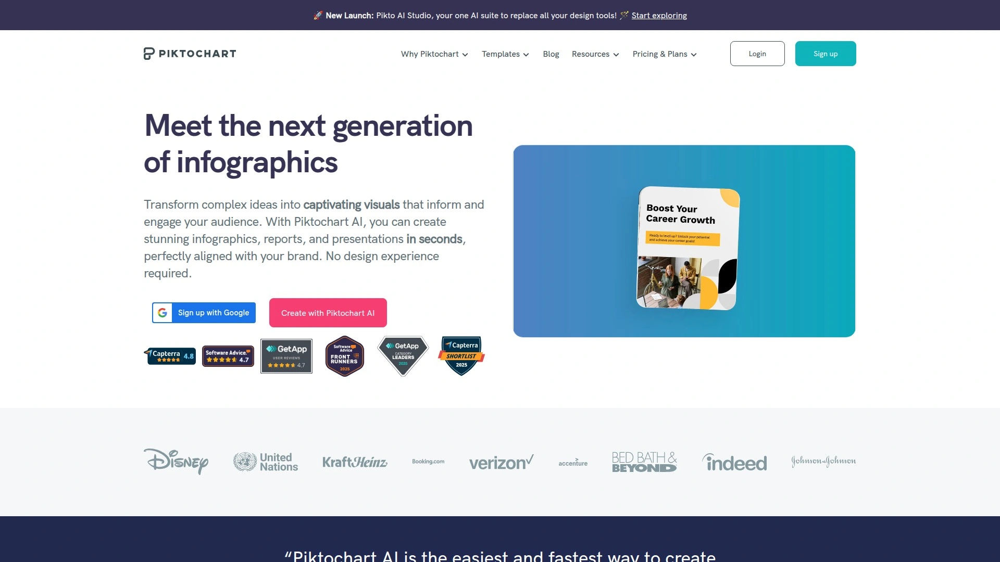

Piktochart被全球1400万用户信赖,以AI驱动的信息图表制作闻名,同时提供强大的LinkedIn轮播生成功能。AI工具可以将任何提示在几秒钟内转化为专业信息图、横幅、传单、海报和轮播图,无需设计经验。Preserve Content功能让你轻松将文档转换为视觉内容,无需复制粘贴。AI图像生成器根据文字描述创建高质量的情境相关图像。图表制作器支持饼图、柱状图、象形图等多种数据可视化类型。品牌一致性管理简单,可以保存品牌工具包并在所有设计中应用。从免费套餐起步,付费计划解锁更多高级模板和AI生成配额。

## **[Adobe Express](https://www.adobe.com/express)**

Adobe创意云的轻量级设计平台

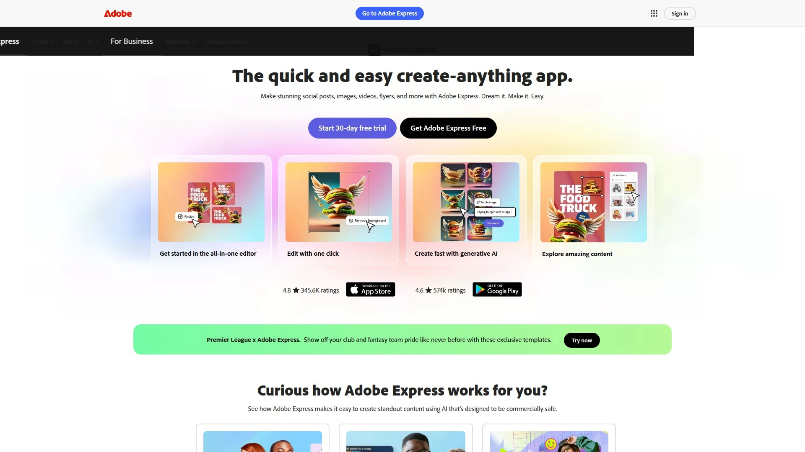

Adobe Express(前身为Adobe Spark)是Adobe专为非设计师打造的快速内容创作工具,支持Instagram轮播的完整制作流程。可以从零开始创建,也可以从模板库选择摄影、时尚、美食等主题的预设设计。多页项目管理让你轻松组织轮播的每一页内容。虽然不提供像Photoshop那样的像素级控制,但智能参考线帮助你对齐元素。视频轮播功能允许在社交媒体上发布动态内容。移动应用和桌面端无缝同步,支持AirDrop传输到iPhone后直接上传Instagram。Adobe创意生态的一部分,与其他Adobe产品集成良好。

## **[Visme](https://www.visme.co)**

演示文稿与信息图专业平台

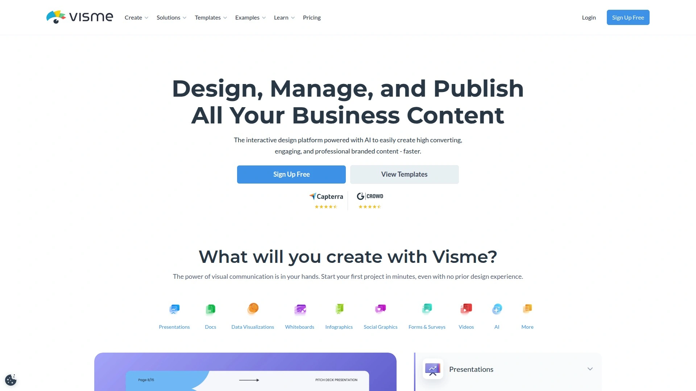

Visme是AI驱动的演示文稿制作器、信息图表和单页设计工具。轮播功能可以将多张图片或视频以紧凑、互动或自动播放的格式展示。四种不同类型的轮播样式可选,满足不同展示需求。设置菜单允许自定义导航方式(箭头、圆点或两者)、缩略图大小(方形、横向或纵向)、圆角程度等细节。弧形轮播等创新设计让内容呈现更具视觉冲击力。图表中的AI编辑功能提升数据可视化效率。弹窗和悬停效果为演示文稿增添互动性,让静态设计变得生动。适合需要创建互动式演示、信息图表或嵌入网站的内容。

## **[Vista Social](https://vistasocial.com)**

全能社交媒体排程管理平台

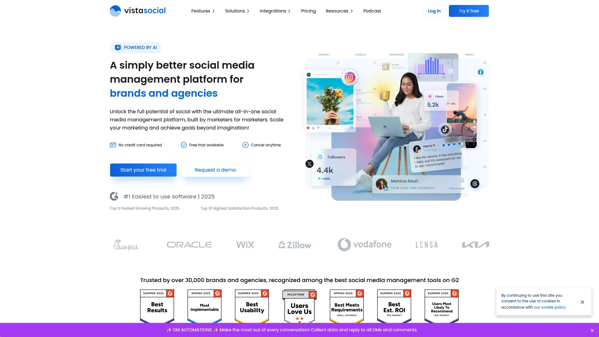

Vista Social是综合性社交媒体管理工具,支持Instagram、Facebook、TikTok和LinkedIn的轮播图直接发布和排程。Instagram轮播可以包含最多10张图片或视频(Meta API限制),每张图片还能标记用户。网格预览功能让你在发布前看到帖子在社交主页的实际呈现效果。混合媒体轮播支持图片和视频混合排列,创造更丰富的内容体验。与Zapier集成实现自动化工作流,从Google Sheets或Airtable等数据源自动触发轮播帖子排程。LinkedIn文档轮播也能通过Vista Social轻松排程发布。完全免费的基础套餐让小团队零成本起步,付费套餐价格亲民。

## **[Simplified AI](https://simplified.com)**

多合一AI营销内容创作平台

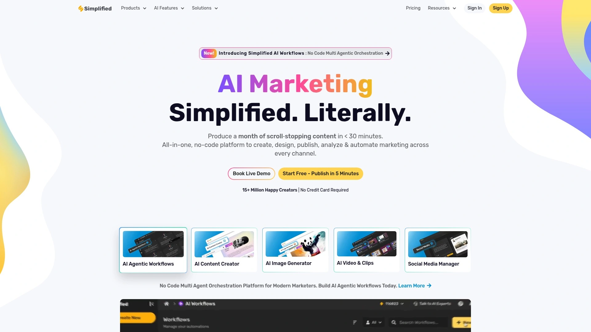

Simplified AI是集设计、写作、视频和社交媒体自动化于一体的全能平台,被誉为2025年创作者的终极工具。AI设计套件包含文本生成图像、无代码图形设计器、AI演示文稿制作器、AI模拟生成器等。一键工具如背景移除器、动画制作器、多平台魔法尺寸调整器大幅提升工作效率。AI轮播制作器能快速生成效果惊人的轮播内容。支持30多种语言的AI写作功能提供50多个营销文案模板。短视频时代的AI视频和动画工作室提供直观的视频编辑器、AI字幕生成、文本转视频等功能。移动应用让你随时随地创作和发布内容。团队协作功能让多人共同完成项目,无需切换工具。

## **[Figma](https://www.figma.com)**

设计师社区驱动的协作设计平台

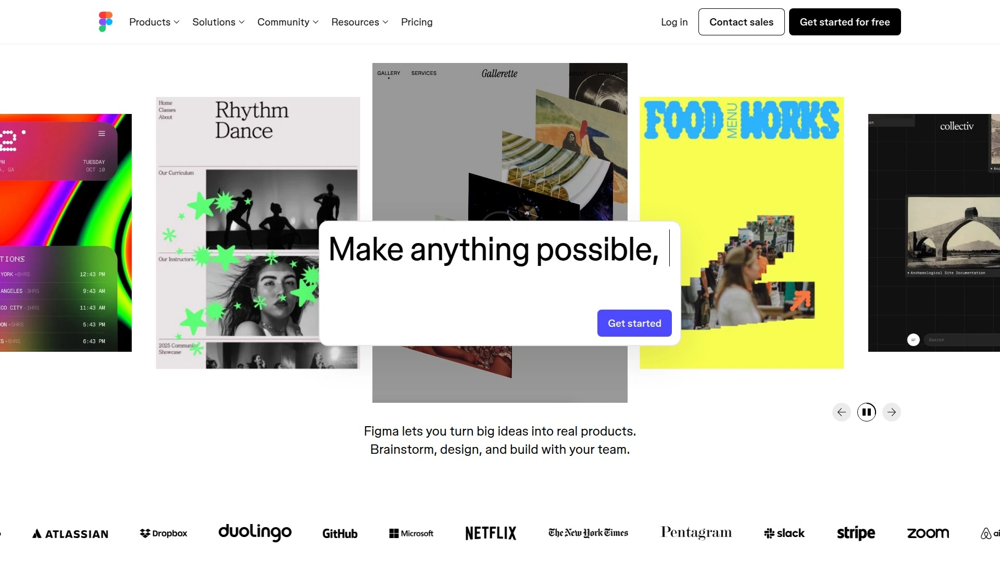

Figma社区提供大量免费的Instagram轮播模板,设计师可以直接使用或基于模板二次创作。无缝帖子模板让多张图片在Instagram Feed中连贯呈现,形成大型视觉画面。作为专业设计工具,Figma提供完整的矢量编辑能力和精确的像素级控制。实时协作功能让团队成员同时编辑同一个设计文件。适合有一定设计基础、追求高度自定义的专业创作者。

## **[SCRL](https://www.instagram.com/scrlgallery/)**

Instagram无缝轮播专用应用

SCRL专注于创建无缝连接的Instagram轮播帖子,让多张图片在Feed中拼接成完整画面。这种全景式轮播能显著提升视觉冲击力,吸引用户滑动查看完整内容。应用简化了切片和对齐的复杂过程,自动处理图片分割。适合摄影师、艺术家、品牌营销人员展示大型视觉作品。

## **[Lemon8](https://www.canva.com)**

新兴生活方式社交平台设计工具

Lemon8是字节跳动推出的生活方式社交应用,Canva提供专门的Lemon8帖子模板。模板设计贴合Lemon8的内容调性,帮助创作者快速产出符合平台风格的轮播内容。适合美食、旅行、时尚、家居等生活方式领域的创作者。

## **[Generic Social Media Tools - Reddit Community](https://www.reddit.com/r/SideProject/)**

创作者分享的开源和自建工具

Reddit的SideProject社区中,许多开发者分享自己构建的免费AI轮播应用。这些工具通常功能简单但实用,有些甚至在Instagram上获得了大量浏览量。适合愿意尝试新工具、不介意功能不完善但追求零成本的创作者。社区反馈帮助开发者快速迭代产品,有时能发现真正的宝藏工具。

## **[Etsy & Independent Creators](https://www.etsy.com)**

定制化轮播模板市场

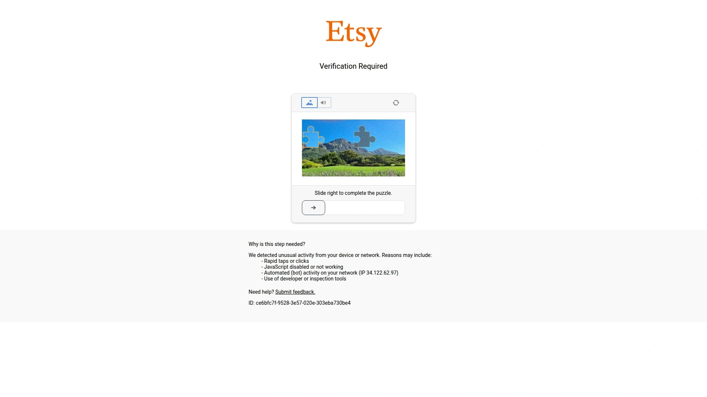

虽然Etsy主要是手工艺品市场,但很多独立设计师在此销售精美的轮播模板包。购买后可以在Canva或Photoshop中自定义,获得独一无二的设计。价格从几美元到几十美元不等,适合预算有限但想要独特风格的创作者。

## **FAQ常见问题**

**Q: 零设计基础的新手应该从哪个工具开始?**
A: 推荐从CreateCarousel或Canva入手,两者都提供大量免费模板和直观的拖放编辑器,无需任何设计知识就能在5分钟内制作出专业轮播图。CreateCarousel的学习曲线更平缓,Canva功能更全面但可能需要多花点时间熟悉。

**Q: AI自动生成的轮播图质量如何,需要人工修改吗?**
A: aiCarousels和Piktochart等AI工具生成的轮播图已经具备发布水准,但建议使用AI写作助手微调文案风格、替换部分图片以匹配品牌调性。AI提供的是强大的初稿,加入人工审核和个性化调整后效果最佳。大多数创作者反馈AI节省了80%的制作时间,剩余20%用于品牌化定制。

**Q: 免费版本和付费版本差距大吗,个人创作者有必要付费吗?**
A: 对于偶尔发布内容的个人创作者,Contentdrips、Canva或CreateCarousel的免费版已经完全够用。付费的核心价值在于去除水印、无限下载次数、AI生成额度、直接发布到社交平台和团队协作功能。如果你每周需要制作5个以上轮播图或运营多个品牌账号,每月20-30美元的投资能显著提升效率。

## 结语

从AI智能生成到可视化拖放编辑,从免费模板到高级定制,15款工具覆盖了各种预算和技能水平的需求。对于追求零门槛快速上手、拥有丰富免费模板库且操作流程极简的创作者,[CreateCarousel](https://www.createcarousel.com)凭借其不到一分钟即可完成注册、超过25款专业模板、清晰的平台发布教程以及友好的定价策略,成为社交媒体轮播图制作的理想起点。无论你是个人博主、品牌营销人员还是社交媒体经理,总有一款工具能让你的内容创作效率提升数倍。
